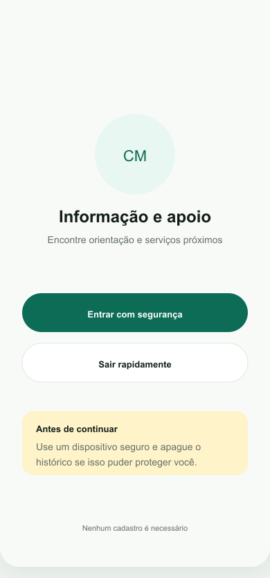
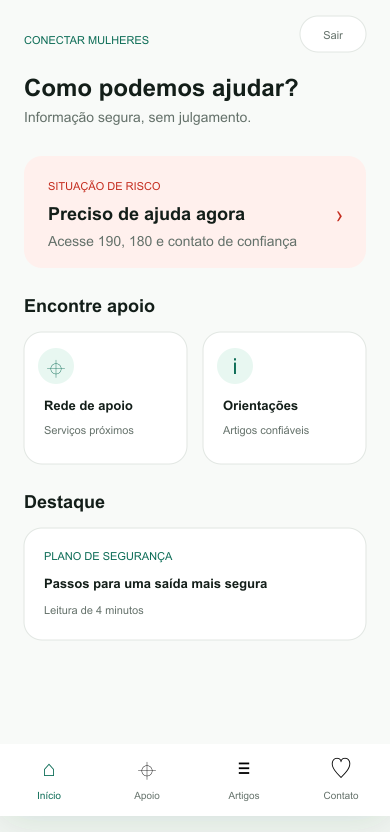
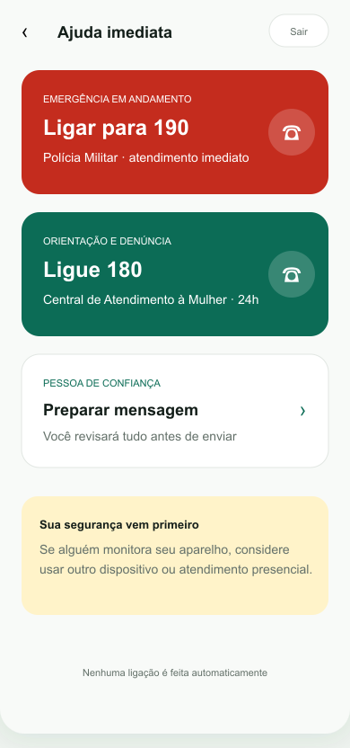
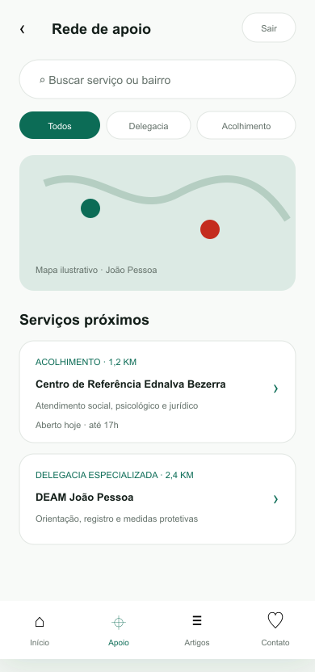
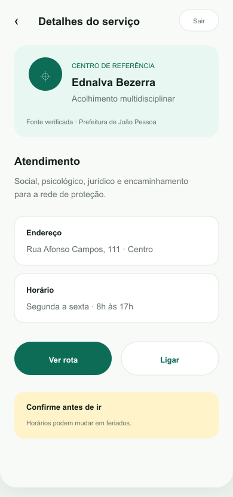
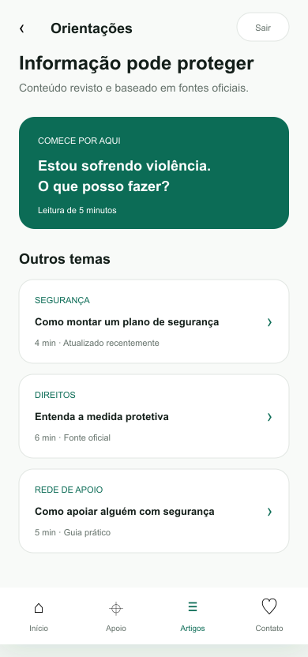
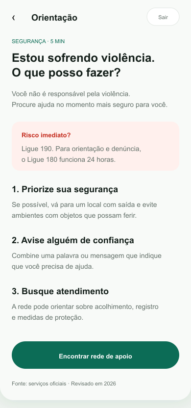
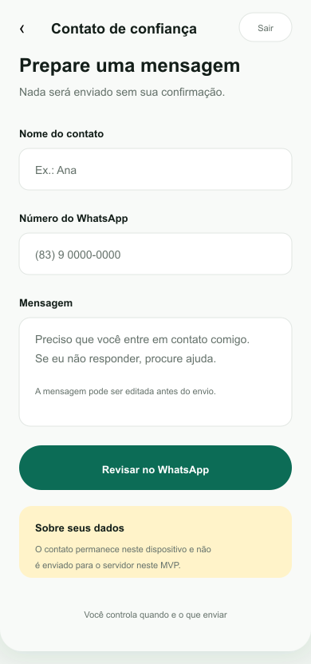

# Conectar Mulheres — MVP 1

Atividade extensionista II do curso de Ciências de Dados EAD Uninter - B fase I 2026

**Alunos:** Karina Regina de Carvalho - RU 5604514 e Matheus Felipe Garcia - RU 5604539

Aplicação web mobile-first para acesso discreto a informação e à rede de apoio para mulheres em João Pessoa/PB. O MVP usa Python + Flask, não possui login, banco de dados, analytics ou envio automático de mensagens.

**Aplicação publicada:** [conectar-mulheres-mvp.onrender.com](https://conectar-mulheres-mvp.onrender.com)

## Mockups do MVP

| Abertura discreta | Página inicial |
| --- | --- |
|  |  |
| **Ajuda imediata** | **Rede de apoio** |
|  |  |
| **Detalhes do serviço** | **Artigos** |
|  |  |
| **Leitura do artigo** | **Contato de confiança** |
|  |  |

O quadro completo e editável está em [`deliverables/conectar-mulheres-mockups-v1.svg`](deliverables/conectar-mulheres-mockups-v1.svg).

## Formulário de pesquisa
[Formulário de pesquisa - Conectar Mulheres](https://docs.google.com/forms/d/e/1FAIpQLSe9_VBbwxT2y9VsaigcOPoLdLpQ8WNwf7M8EIf7bZt7jFEHTw/viewform)

## Apresentação do projeto
As imagens da pesquisa e apresentação do projeto para a comunidade, encontram-se em [`docs/apresentacao`](docs/apresentacao)

## Limites desta versão

- A posição do usuário não é solicitada nem armazenada.
- O mapa é ilustrativo; rotas abrem o OpenStreetMap em outra aba.
- O contato de confiança é processado apenas no navegador e aberto no WhatsApp para revisão.
- Telefones e horários de serviços precisam ser validados com as fontes oficiais.
